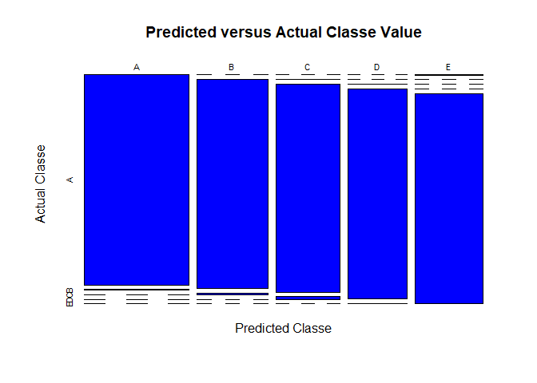

# Exercise Type from Movement Data by Emily Shives

## Overview
The goal of this project is to use movement data to determine the manner in which a dumbbell exercise was performed. After preprocessing the data to remove NA values and creating subsets of the data to perform cross validation, I fit several different models and compared their accuracy. The final model chosen was the one created using random forests. This final model had an approximate predicted out of sample error of less than 0.01 and was applied to the test data set provided in the project.


## Data Processing and Exploratory Data Analysis
First, the files must be downloaded. 

```r
library(caret)
```

```
## Warning: package 'caret' was built under R version 3.4.2
```

```
## Loading required package: lattice
```

```
## Loading required package: ggplot2
```

```r
library(randomForest)
```

```
## Warning: package 'randomForest' was built under R version 3.4.2
```

```
## randomForest 4.6-12
```

```
## Type rfNews() to see new features/changes/bug fixes.
```

```
## 
## Attaching package: 'randomForest'
```

```
## The following object is masked from 'package:ggplot2':
## 
##     margin
```

```r
URLtrain="https://d396qusza40orc.cloudfront.net/predmachlearn/pml-training.csv"
URLtest="https://d396qusza40orc.cloudfront.net/predmachlearn/pml-testing.csv"
download.file(URLtrain,destfile='training.csv')
download.file(URLtest,destfile='testing.csv')
```
Next, I read the data in from the files. 

```r
train<-read.csv("training.csv",na.strings = c("NA",""))
test<-read.csv("testing.csv",na.strings=c("NA",""))
str(train)
```

```
## 'data.frame':	19622 obs. of  160 variables:
##  $ X                       : int  1 2 3 4 5 6 7 8 9 10 ...
##  $ user_name               : Factor w/ 6 levels "adelmo","carlitos",..: 2 2 2 2 2 2 2 2 2 2 ...
##  $ raw_timestamp_part_1    : int  1323084231 1323084231 1323084231 1323084232 1323084232 1323084232 1323084232 1323084232 1323084232 1323084232 ...
##  $ raw_timestamp_part_2    : int  788290 808298 820366 120339 196328 304277 368296 440390 484323 484434 ...
##  $ cvtd_timestamp          : Factor w/ 20 levels "02/12/2011 13:32",..: 9 9 9 9 9 9 9 9 9 9 ...
##  $ new_window              : Factor w/ 2 levels "no","yes": 1 1 1 1 1 1 1 1 1 1 ...
##  $ num_window              : int  11 11 11 12 12 12 12 12 12 12 ...
##  $ roll_belt               : num  1.41 1.41 1.42 1.48 1.48 1.45 1.42 1.42 1.43 1.45 ...
##  $ pitch_belt              : num  8.07 8.07 8.07 8.05 8.07 8.06 8.09 8.13 8.16 8.17 ...
##  $ yaw_belt                : num  -94.4 -94.4 -94.4 -94.4 -94.4 -94.4 -94.4 -94.4 -94.4 -94.4 ...
##  $ total_accel_belt        : int  3 3 3 3 3 3 3 3 3 3 ...
##  $ kurtosis_roll_belt      : Factor w/ 396 levels "-0.016850","-0.021024",..: NA NA NA NA NA NA NA NA NA NA ...
##  $ kurtosis_picth_belt     : Factor w/ 316 levels "-0.021887","-0.060755",..: NA NA NA NA NA NA NA NA NA NA ...
##  $ kurtosis_yaw_belt       : Factor w/ 1 level "#DIV/0!": NA NA NA NA NA NA NA NA NA NA ...
##  $ skewness_roll_belt      : Factor w/ 394 levels "-0.003095","-0.010002",..: NA NA NA NA NA NA NA NA NA NA ...
##  $ skewness_roll_belt.1    : Factor w/ 337 levels "-0.005928","-0.005960",..: NA NA NA NA NA NA NA NA NA NA ...
##  $ skewness_yaw_belt       : Factor w/ 1 level "#DIV/0!": NA NA NA NA NA NA NA NA NA NA ...
##  $ max_roll_belt           : num  NA NA NA NA NA NA NA NA NA NA ...
##  $ max_picth_belt          : int  NA NA NA NA NA NA NA NA NA NA ...
##  $ max_yaw_belt            : Factor w/ 67 levels "-0.1","-0.2",..: NA NA NA NA NA NA NA NA NA NA ...
##  $ min_roll_belt           : num  NA NA NA NA NA NA NA NA NA NA ...
##  $ min_pitch_belt          : int  NA NA NA NA NA NA NA NA NA NA ...
##  $ min_yaw_belt            : Factor w/ 67 levels "-0.1","-0.2",..: NA NA NA NA NA NA NA NA NA NA ...
##  $ amplitude_roll_belt     : num  NA NA NA NA NA NA NA NA NA NA ...
##  $ amplitude_pitch_belt    : int  NA NA NA NA NA NA NA NA NA NA ...
##  $ amplitude_yaw_belt      : Factor w/ 3 levels "#DIV/0!","0.00",..: NA NA NA NA NA NA NA NA NA NA ...
##  $ var_total_accel_belt    : num  NA NA NA NA NA NA NA NA NA NA ...
##  $ avg_roll_belt           : num  NA NA NA NA NA NA NA NA NA NA ...
##  $ stddev_roll_belt        : num  NA NA NA NA NA NA NA NA NA NA ...
##  $ var_roll_belt           : num  NA NA NA NA NA NA NA NA NA NA ...
##  $ avg_pitch_belt          : num  NA NA NA NA NA NA NA NA NA NA ...
##  $ stddev_pitch_belt       : num  NA NA NA NA NA NA NA NA NA NA ...
##  $ var_pitch_belt          : num  NA NA NA NA NA NA NA NA NA NA ...
##  $ avg_yaw_belt            : num  NA NA NA NA NA NA NA NA NA NA ...
##  $ stddev_yaw_belt         : num  NA NA NA NA NA NA NA NA NA NA ...
##  $ var_yaw_belt            : num  NA NA NA NA NA NA NA NA NA NA ...
##  $ gyros_belt_x            : num  0 0.02 0 0.02 0.02 0.02 0.02 0.02 0.02 0.03 ...
##  $ gyros_belt_y            : num  0 0 0 0 0.02 0 0 0 0 0 ...
##  $ gyros_belt_z            : num  -0.02 -0.02 -0.02 -0.03 -0.02 -0.02 -0.02 -0.02 -0.02 0 ...
##  $ accel_belt_x            : int  -21 -22 -20 -22 -21 -21 -22 -22 -20 -21 ...
##  $ accel_belt_y            : int  4 4 5 3 2 4 3 4 2 4 ...
##  $ accel_belt_z            : int  22 22 23 21 24 21 21 21 24 22 ...
##  $ magnet_belt_x           : int  -3 -7 -2 -6 -6 0 -4 -2 1 -3 ...
##  $ magnet_belt_y           : int  599 608 600 604 600 603 599 603 602 609 ...
##  $ magnet_belt_z           : int  -313 -311 -305 -310 -302 -312 -311 -313 -312 -308 ...
##  $ roll_arm                : num  -128 -128 -128 -128 -128 -128 -128 -128 -128 -128 ...
##  $ pitch_arm               : num  22.5 22.5 22.5 22.1 22.1 22 21.9 21.8 21.7 21.6 ...
##  $ yaw_arm                 : num  -161 -161 -161 -161 -161 -161 -161 -161 -161 -161 ...
##  $ total_accel_arm         : int  34 34 34 34 34 34 34 34 34 34 ...
##  $ var_accel_arm           : num  NA NA NA NA NA NA NA NA NA NA ...
##  $ avg_roll_arm            : num  NA NA NA NA NA NA NA NA NA NA ...
##  $ stddev_roll_arm         : num  NA NA NA NA NA NA NA NA NA NA ...
##  $ var_roll_arm            : num  NA NA NA NA NA NA NA NA NA NA ...
##  $ avg_pitch_arm           : num  NA NA NA NA NA NA NA NA NA NA ...
##  $ stddev_pitch_arm        : num  NA NA NA NA NA NA NA NA NA NA ...
##  $ var_pitch_arm           : num  NA NA NA NA NA NA NA NA NA NA ...
##  $ avg_yaw_arm             : num  NA NA NA NA NA NA NA NA NA NA ...
##  $ stddev_yaw_arm          : num  NA NA NA NA NA NA NA NA NA NA ...
##  $ var_yaw_arm             : num  NA NA NA NA NA NA NA NA NA NA ...
##  $ gyros_arm_x             : num  0 0.02 0.02 0.02 0 0.02 0 0.02 0.02 0.02 ...
##  $ gyros_arm_y             : num  0 -0.02 -0.02 -0.03 -0.03 -0.03 -0.03 -0.02 -0.03 -0.03 ...
##  $ gyros_arm_z             : num  -0.02 -0.02 -0.02 0.02 0 0 0 0 -0.02 -0.02 ...
##  $ accel_arm_x             : int  -288 -290 -289 -289 -289 -289 -289 -289 -288 -288 ...
##  $ accel_arm_y             : int  109 110 110 111 111 111 111 111 109 110 ...
##  $ accel_arm_z             : int  -123 -125 -126 -123 -123 -122 -125 -124 -122 -124 ...
##  $ magnet_arm_x            : int  -368 -369 -368 -372 -374 -369 -373 -372 -369 -376 ...
##  $ magnet_arm_y            : int  337 337 344 344 337 342 336 338 341 334 ...
##  $ magnet_arm_z            : int  516 513 513 512 506 513 509 510 518 516 ...
##  $ kurtosis_roll_arm       : Factor w/ 329 levels "-0.02438","-0.04190",..: NA NA NA NA NA NA NA NA NA NA ...
##  $ kurtosis_picth_arm      : Factor w/ 327 levels "-0.00484","-0.01311",..: NA NA NA NA NA NA NA NA NA NA ...
##  $ kurtosis_yaw_arm        : Factor w/ 394 levels "-0.01548","-0.01749",..: NA NA NA NA NA NA NA NA NA NA ...
##  $ skewness_roll_arm       : Factor w/ 330 levels "-0.00051","-0.00696",..: NA NA NA NA NA NA NA NA NA NA ...
##  $ skewness_pitch_arm      : Factor w/ 327 levels "-0.00184","-0.01185",..: NA NA NA NA NA NA NA NA NA NA ...
##  $ skewness_yaw_arm        : Factor w/ 394 levels "-0.00311","-0.00562",..: NA NA NA NA NA NA NA NA NA NA ...
##  $ max_roll_arm            : num  NA NA NA NA NA NA NA NA NA NA ...
##  $ max_picth_arm           : num  NA NA NA NA NA NA NA NA NA NA ...
##  $ max_yaw_arm             : int  NA NA NA NA NA NA NA NA NA NA ...
##  $ min_roll_arm            : num  NA NA NA NA NA NA NA NA NA NA ...
##  $ min_pitch_arm           : num  NA NA NA NA NA NA NA NA NA NA ...
##  $ min_yaw_arm             : int  NA NA NA NA NA NA NA NA NA NA ...
##  $ amplitude_roll_arm      : num  NA NA NA NA NA NA NA NA NA NA ...
##  $ amplitude_pitch_arm     : num  NA NA NA NA NA NA NA NA NA NA ...
##  $ amplitude_yaw_arm       : int  NA NA NA NA NA NA NA NA NA NA ...
##  $ roll_dumbbell           : num  13.1 13.1 12.9 13.4 13.4 ...
##  $ pitch_dumbbell          : num  -70.5 -70.6 -70.3 -70.4 -70.4 ...
##  $ yaw_dumbbell            : num  -84.9 -84.7 -85.1 -84.9 -84.9 ...
##  $ kurtosis_roll_dumbbell  : Factor w/ 397 levels "-0.0035","-0.0073",..: NA NA NA NA NA NA NA NA NA NA ...
##  $ kurtosis_picth_dumbbell : Factor w/ 400 levels "-0.0163","-0.0233",..: NA NA NA NA NA NA NA NA NA NA ...
##  $ kurtosis_yaw_dumbbell   : Factor w/ 1 level "#DIV/0!": NA NA NA NA NA NA NA NA NA NA ...
##  $ skewness_roll_dumbbell  : Factor w/ 400 levels "-0.0082","-0.0096",..: NA NA NA NA NA NA NA NA NA NA ...
##  $ skewness_pitch_dumbbell : Factor w/ 401 levels "-0.0053","-0.0084",..: NA NA NA NA NA NA NA NA NA NA ...
##  $ skewness_yaw_dumbbell   : Factor w/ 1 level "#DIV/0!": NA NA NA NA NA NA NA NA NA NA ...
##  $ max_roll_dumbbell       : num  NA NA NA NA NA NA NA NA NA NA ...
##  $ max_picth_dumbbell      : num  NA NA NA NA NA NA NA NA NA NA ...
##  $ max_yaw_dumbbell        : Factor w/ 72 levels "-0.1","-0.2",..: NA NA NA NA NA NA NA NA NA NA ...
##  $ min_roll_dumbbell       : num  NA NA NA NA NA NA NA NA NA NA ...
##  $ min_pitch_dumbbell      : num  NA NA NA NA NA NA NA NA NA NA ...
##  $ min_yaw_dumbbell        : Factor w/ 72 levels "-0.1","-0.2",..: NA NA NA NA NA NA NA NA NA NA ...
##  $ amplitude_roll_dumbbell : num  NA NA NA NA NA NA NA NA NA NA ...
##   [list output truncated]
```

A quick look at the data shows that there are many columns with NAs. Not all variables need to be used to build a model, so I will not use those columns or the first 7, which contain mostly identifying information rather than movement data. The same processing must be applied to the test data so that eventually the model can be run on that data set. For the purpose of cross validation, below I also create a testing and training set from the train data.

```r
set.seed(1987)
keep<-colSums(is.na(train))==0
trainsub<-train[,keep]
trainsub<-trainsub[,-(1:7)]
testsub<-test[,keep]
testsub<-testsub[,-(1:7)]
inTrain<-createDataPartition(y=trainsub$classe,p=0.7,list=FALSE)
training<-trainsub[inTrain,]
testing<-trainsub[-inTrain,]
```


## Model Building and Evaluation
Now, I will use the caret package to create a few different models and compare their results. The following methods are represented below, with their confusion matrices: CART (rpart), random forest (using randomforest()), boosting (gbm), linear discriminant analysis (lda), and naive Bayes (nb). 


```r
#modrp<-train(classe~.,data=training,method="rpart")
#predrp<-predict(modrp,newdata=testing)
#cmrp<-confusionMatrix(predrp,testing$classe)
modrf<-randomForest(classe~.,data=training)
predrf<-predict(modrf,newdata=testing)
cmrf<-confusionMatrix(predrf,testing$classe)
cmrf
```

```
## Confusion Matrix and Statistics
## 
##           Reference
## Prediction    A    B    C    D    E
##          A 1673    5    0    0    0
##          B    0 1133    8    0    0
##          C    0    1 1017   13    0
##          D    0    0    1  951    3
##          E    1    0    0    0 1079
## 
## Overall Statistics
##                                           
##                Accuracy : 0.9946          
##                  95% CI : (0.9923, 0.9963)
##     No Information Rate : 0.2845          
##     P-Value [Acc > NIR] : < 2.2e-16       
##                                           
##                   Kappa : 0.9931          
##  Mcnemar's Test P-Value : NA              
## 
## Statistics by Class:
## 
##                      Class: A Class: B Class: C Class: D Class: E
## Sensitivity            0.9994   0.9947   0.9912   0.9865   0.9972
## Specificity            0.9988   0.9983   0.9971   0.9992   0.9998
## Pos Pred Value         0.9970   0.9930   0.9864   0.9958   0.9991
## Neg Pred Value         0.9998   0.9987   0.9981   0.9974   0.9994
## Prevalence             0.2845   0.1935   0.1743   0.1638   0.1839
## Detection Rate         0.2843   0.1925   0.1728   0.1616   0.1833
## Detection Prevalence   0.2851   0.1939   0.1752   0.1623   0.1835
## Balanced Accuracy      0.9991   0.9965   0.9942   0.9929   0.9985
```

```r
modgbm<-train(classe~.,data=training,method="gbm",verbose=FALSE)
```

```
## Warning: package 'gbm' was built under R version 3.4.2
```

```
## Loading required package: survival
```

```
## 
## Attaching package: 'survival'
```

```
## The following object is masked from 'package:caret':
## 
##     cluster
```

```
## Loading required package: splines
```

```
## Loading required package: parallel
```

```
## Loaded gbm 2.1.3
```

```r
predgbm<-predict(modgbm,newdata=testing)
cmgbm<-confusionMatrix(predgbm,testing$classe)
cmgbm
```

```
## Confusion Matrix and Statistics
## 
##           Reference
## Prediction    A    B    C    D    E
##          A 1663   52    0    0    1
##          B    9 1056   34    4   15
##          C    0   27  977   35    6
##          D    1    3   14  917   15
##          E    1    1    1    8 1045
## 
## Overall Statistics
##                                           
##                Accuracy : 0.9614          
##                  95% CI : (0.9562, 0.9662)
##     No Information Rate : 0.2845          
##     P-Value [Acc > NIR] : < 2.2e-16       
##                                           
##                   Kappa : 0.9512          
##  Mcnemar's Test P-Value : NA              
## 
## Statistics by Class:
## 
##                      Class: A Class: B Class: C Class: D Class: E
## Sensitivity            0.9934   0.9271   0.9522   0.9512   0.9658
## Specificity            0.9874   0.9869   0.9860   0.9933   0.9977
## Pos Pred Value         0.9691   0.9445   0.9349   0.9653   0.9896
## Neg Pred Value         0.9974   0.9826   0.9899   0.9905   0.9923
## Prevalence             0.2845   0.1935   0.1743   0.1638   0.1839
## Detection Rate         0.2826   0.1794   0.1660   0.1558   0.1776
## Detection Prevalence   0.2916   0.1900   0.1776   0.1614   0.1794
## Balanced Accuracy      0.9904   0.9570   0.9691   0.9723   0.9818
```

```r
#modlda<-train(classe~.,data=training,method="lda")
#predlda<-predict(modlda,newdata=testing)
#cmlda<-confusionMatrix(predlda,testing$classe)
#modnb<-train(classe~.,data=training,method="nb")
#prednb<-predict(modnb,newdata=testing)
#cmnb<-confusionMatrix(prednb,testing$classe)
```

The accuracy rates are as follows: rpart - 0.4987, random forest - 0.9945624, gbm - 0.9614274, lda - 0.7067, and nb - 0.7337. Based on these accuracies in the set of data used for cross validation (called testing), the two best choices are random forest and boosting. Random forest has both a higher accuracy rate and a faster run time, so the final model select is the random forest model.

The figure below shows the predicted versus actual classe value for the random forest model chosen as the final model.

```r
pred<-predict(modrf,newdata=testing)
CM<-confusionMatrix(pred,testing$classe)
plot(CM$table,xlab="Predicted Classe",ylab="Actual Classe",main="Predicted versus Actual Classe Value",col="blue")
```

<!-- -->


## Out of Sample Error
Since we are dealing with discrete rather than continuous data, I will use the accuracy rate on the test set as a measure of the out of sample error. The accuracy in the testing data for the selected random forest model is 0.9945624, and thus the approximate out of sample error rate is 0.0054376.


## Model applied to Test Data Set
I will now apply the final model to the originally provided test data set which has already been processed. Below the predicted values for the test data are calculated.

```r
pred<-predict(modrf,newdata=testsub)
```


## Conclusion
The goal of your project is to predict the manner in which individuals did the dumbbell exercise using movement data. Using the variables with no NAs in the column, I selected the random forest method because it had the highest accuracy on my cross validation set, and thus the lowest predicted out of sample error rate of the methods that I tested. Finally, using my model I made predictions for the 20 data points in the test data set.
